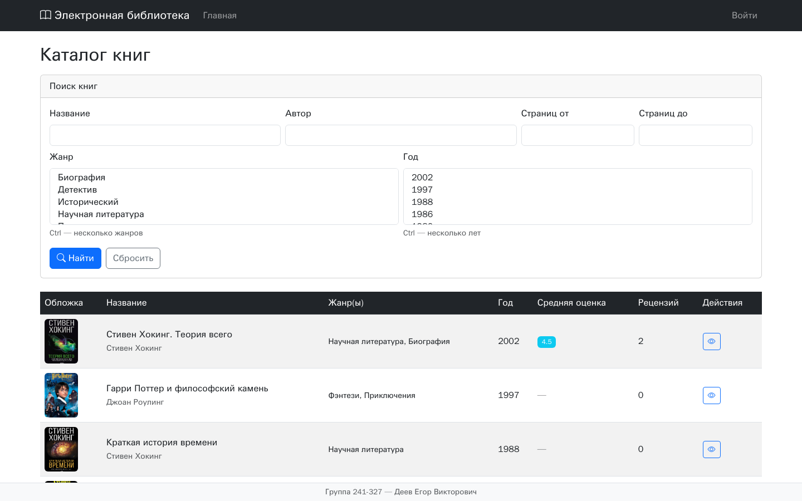

# Web Development

[Русский](README.md) · **English**

[](https://github.com/EDeev/web-dev/actions/workflows/ci.yml)
[](https://github.com/EDeev/web-dev/releases)

Labs, homework and the exam project for the "Web Development" course at Moscow Polytechnic University:
six Flask apps, 37 Python exercises with tests, and an online library.

**Status:** coursework (Moscow Polytech, group 241-327, 2025/26), completed, archived ·
labs at [web-dev.deev.space](https://web-dev.deev.space), exam at [ex-web.deev.su](https://ex-web.deev.su)



**Stack:** Python · Flask · Jinja2 · Flask-Login · Flask-SQLAlchemy · Flask-Migrate · SQLite/MySQL · Bootstrap 5 · pytest

| Folder | Contents |
|---|---|
| `labs/lab-1` | blog post template with Flask and Jinja2 |
| `labs/lab-2` | request data: parameters, headers, cookies, forms, phone number validation |
| `labs/lab-3` | sign-in with Flask-Login, protected pages, sessions |
| `labs/lab-4` | user accounts CRUD: database, validation, password hashing |
| `labs/lab-5` | roles and permissions, visit log, reports with CSV export |
| `labs/lab-6` | education portal: course reviews, ratings, pagination, filters |
| `hws/hw-1`, `hws/hw-2` | 37 Python exercises (algorithms, files, decorators, generators, OOP) and 241 tests |
| `ex` | exam: book catalog with search, reviews and roles (admin, moderator, user) |

## Running

```bash
cd labs/lab-3 && pip install -r requirements.txt
cd app && FLASK_DEBUG=1 python app.py

cd ex && pip install -r requirements.txt
python db/db_seed.py          # database, roles and test users (passwords are printed)
python run.py
```

`SECRET_KEY` and `FLASK_DEBUG` come from environment variables. Homework tests:
`cd hws/hw-1 && pytest test.py`.

**Docker:** the exam app `ex/` as a prebuilt image:

```bash
docker run -d -p 8000:8000 -e SECRET_KEY=change-me -v webdev-db:/app/db -v webdev-uploads:/app/app/static/uploads ghcr.io/edeev/web-dev
docker logs <container>       # on first start: logins and passwords of the test users
```

(same as `git.deev.su/edeev/web-dev`), then open http://localhost:8000.

## License

Coursework (Web Development, Moscow Polytechnic University, 2025/26). The code is open for study; there
is no separate license.

## Author

**Egor Deev** — [GitHub](https://github.com/EDeev) · [Telegram](https://t.me/DeevEgor) · [egor@deev.space](mailto:egor@deev.space)

---

<div align="center">
  <sub>⭐ If you find this project useful, give it a star on GitHub!</sub>
  <p><sub>Made with ❤️ — <a href="https://deev.space">deev.space</a></sub></p>
</div>
